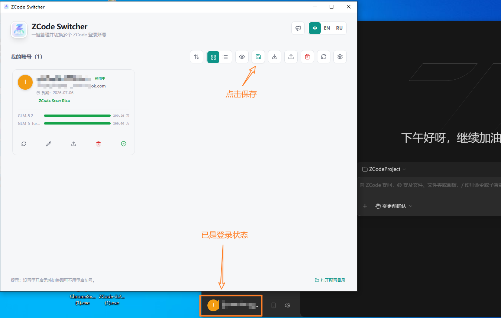
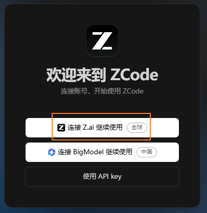
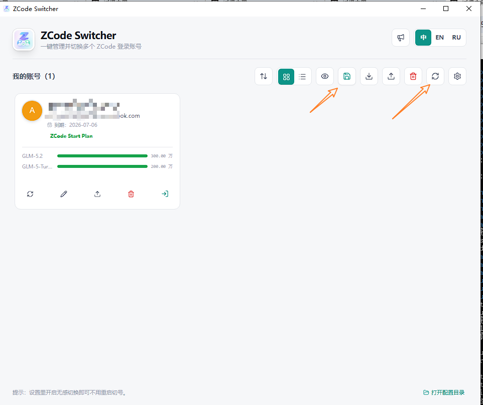
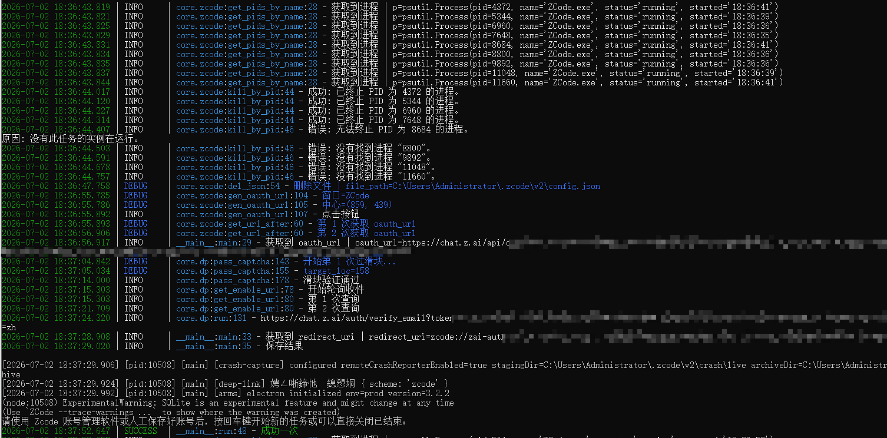

# Zcode-register 注册工具使用说明

## 核心思想

`Zcode-register`项目整体上采用自动化的方式实现，涉及到与`Zcode`客户端的操作使用的是键鼠自动化，涉及到浏览器操作的使用的是浏览器自动化。

由于`Zcode`更新速度较快，且市面上有大量的账号管理切换工具，秉承着不重复造轮子的原则，`Zcode-register`只负责注册账号与`Zcode`客户端授权登录。需要与其他账号管理切换工具搭配使用。例如：

- zcode-switcher: https://github.com/git-l-1031/zcode-switcher

由于搭配使用的工具不唯一，因此当`Zcode-register`完成注册与登录授权后，需要人工点击保存账号。以 [zcode-switcher](https://github.com/git-l-1031/zcode-switcher) 为例：

当`Zcode`客户端已经完成了登录后，便可保存当前的账号到本地，便于下次使用时可以不需要登录而直接切换。具体的流程可以在**运行顺序**章节查看。



当然你也可以只使用`Zcode-register`进行注册登录授权，手动管理账号密码。

## 注意事项

当登录开始时，点击`连接Z.ai继续使用`按钮，`Zcode`客户端会生成登录授权链接并自动打开浏览器，而该链接里面的参数在登陆成功后授权时`Zcode`客户端需要检查是否一直，因此程序使用`mitm`中间人攻击的方式监听电脑的所有请求，以获取到该链接。



在 [releases]([https://github.com/sui-bian-ovo/Zcode-register/releases/) 下载程序后，请务必将程序完整解压到 `C:\dist` 目录，确保 `Zcode-Register.exe` 的运行路径固定为 `C:\dist\Zcode-Register.exe`，也不要随意更改例如`venv`文件夹的名字。这是因为`mitmproxy.exe`中涉及的 Python 文件路径已在打包时写死，如果路径发生变化，会导致`mitmproxy`无法正确加载脚本，无法拦截到授权链接。

程序在点击`Zcode`客户端的`连接Z.ai继续使用`步骤时会使用鼠标，此时不能使用电脑，也不要让任何软件置顶且占用`Zcode`客户端的`连接Z.ai继续使用`按钮的位置，否则会因为无法点到按钮导致等不到 OAuth 授权地址而报错。不管怎样，程序在任何一个流程报错，都会重新开始新的流程。

运行前确认当前`ZCode`本地账号不需要保留。程序启动注册前会删除`ZCode`配置目录下的`credentials.json`与`config.json`。这是为了让`ZCode`进入干净的登录状态，打开客户端直接是登录页面。

## 整体流程

整体上程序的流程为：

```text
启动 mitm 监听
    ↓
删除已有的授权凭据    
    ↓
启动 Zcode 并使用键鼠自动化点击按钮
    ↓
mitm 中间人攻击捕获 chat.z.ai 的 OAuth 授权地址
    ↓
自动化框架启动浏览器 进入注册页
    ↓
购买临时邮箱
    ↓
自动填写邮箱、用户名、密码
    ↓
自动处理滑块验证
    ↓
轮询邮箱，获取验证邮件链接
    ↓
完成邮箱验证和账号注册
    ↓
捕获 zcode://zai-auth/callback 回调地址
    ↓
打开回调地址，让 ZCode 写入本地登录配置
    ↓
等待人工接管，保存当前账号
```

## 配置文件

程序依赖 `config.yaml`。会用到下面几组配置：

```yaml
zcode:
  # zcode 进程名 如非必要保持不变
  process_name: 'ZCode.exe'
  # zcode 窗口名 如非必要保持不变
  window_name: 'zcode'
  # zcode 保存凭证的文件夹
  folder_path: 'C:\Users\Administrator\.zcode\v2'

dp:
  proxy: 'http://127.0.0.1:7897'
  browser_path: 'C:\Program Files\Google\Chrome\Application\chrome.exe'

mitm:
  port: '8080'

mailnest:
  # 注意 url 末尾没有 /
  api_url: 'https://mailnest.top'
  # 申请 api key https://mailnest.top/account
  ak: 'ak'
  # z-code 项目代码 https://mailnest.top/buy-email
  project_code: 'z-ai001'
```

几个配置的含义：

- `mitm.port` 是抓取 OAuth 授权地址用的本地代理端口。具体见下一节中的说明。
- `zcode`
  - `zcode.process_name` 用来识别并关闭已有的`ZCode`进程，避免旧登录状态影响键鼠自动化。
  - `zcode.window_name` 用来定位`ZCode`授权窗口，程序会自动点击窗口里的授权按钮。
  - `zcode.folder_path` 是`ZCode`保存 `credentials.json` 和 `config.json` 的目录。程序开始前会输出授权凭证，使得打开`Zcode`客户端时显示登录页面；注册成功后会读取这里面的文件并导出结果。
- `mailnest`
  - `mailnest.api_url`、`mailnest.ak`、`mailnest.project_code`配置邮箱平台购买临时邮箱和收取验证邮件。需要第三方接码平台[迈巢](https://mailnest.top/)中，配置`ak`和`zcode`的项目代码。找来找去，目前只在找到这一个平台支持`zcode`的接码。
- `dp`
  - `dp.proxy` 是浏览器注册过程使用的代理。只有在非中国大陆的网络时才会允许使用邮箱注册。
  - `dp.browser_path` 是自动化浏览器的路径。

## 运行顺序

配置代理程序，注意只能打开代理程序，但是不能接管系统代理，只能暴露一个端口，仅给自动化打开的浏览器使用。即对应配置文件中`dp.proxy`的配置项。

运行 `run_mitm.bat`，程序会自动启动本地`mitmproxy`代理服务，监听配置项中`mitm.port` 对应的端口。在`Windows`的设置中，配置代理端口为`mitm.port` 对应的端口，使得`Windows`中的网络请求经过`mitmproxy `代理。

如果是第一次使用，需要安装系统证书：在浏览器中访问 [http://mitm.it](http://mitm.it) 页面，在该页面下载对应`Windows`平台的证书并进行安装，安装时选择“受信任的根证书颁发机构”，完成后关闭浏览器并返回程序窗口即可，证书安装完成后`mitmproxy`才能正常解密 HTTPS 流量并捕获 OAuth 授权请求。

然后再启动主程序`Zcode-register-v1.0.exe`。 会提示：

```text
程序运行时会删除 zcode 登录凭证 请务必确认没有重要资产
按回车键开始 否则请直接关闭:
```

确认可以清理当前`ZCode`本地登录状态后，再按任意键继续。

当`Zcode-register`完成登录与授权后，会摊下来等待用户进行账号保存，当保存后按回车键即可开始下一次的注册与授权。注意 [zcode-switcher](https://github.com/git-l-1031/zcode-switcher) 要刷新后再进行保存。



以下是一次完整流程的输出截图：



## 输出文件

运行成功后，主要看这几个文件或目录。

### 成功.txt

每成功注册一次，会追加一行：

```text
邮箱----密码----credentials.json 内容----config.json 内容
```

这是最直接的结果文件。

### logs/

程序日志会写到这里：

```text
logs/
└─ 20260626_203000.log
```

注册失败、接口返回异常、验证码失败、收件失败等信息都会写入日志。

### mitm_log.txt

`run_mitm.exe` 会把捕获到的 OAuth 授权地址写入这个文件。主程序会从这里读取最新的授权地址。
